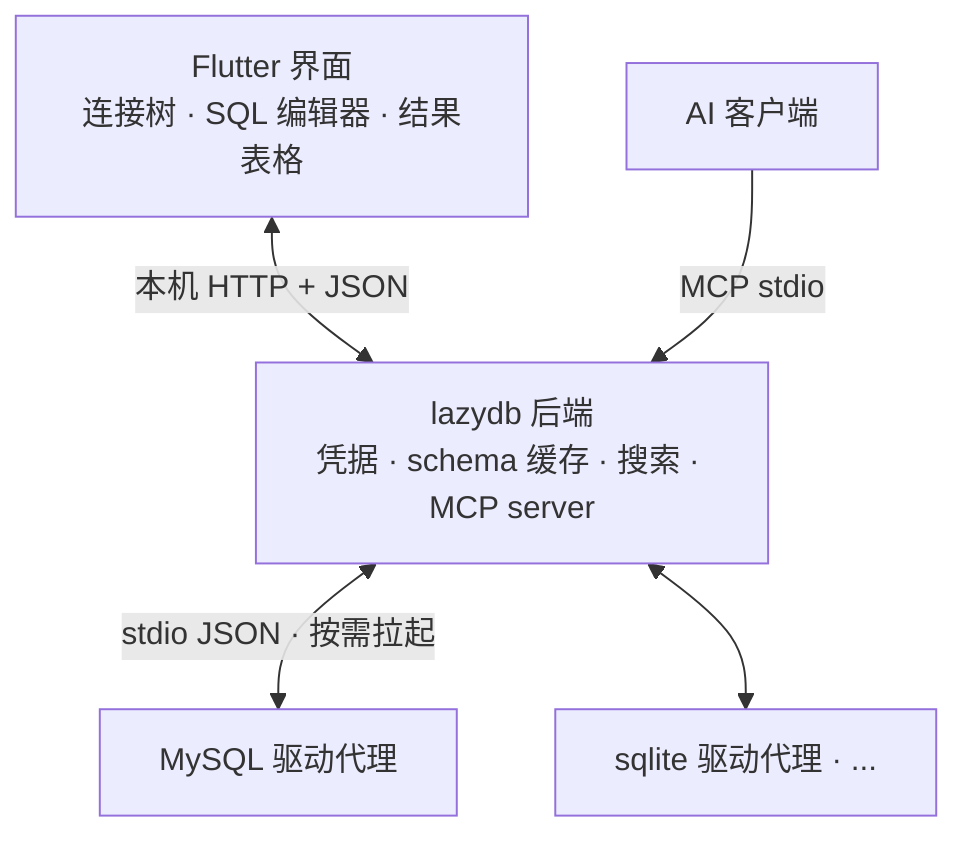

# lazydb 术语表

一句话定义，供 issue、代码、文档统一用词。正式决策见 `docs/adr/`。

| 术语 | 定义 |
|---|---|
| **lazydb** | 跨数据库桌面客户端：浏览/查询多种数据源，本地缓存结构，供 AI 经 MCP 调用 |
| **数据源** | 任何能被 lazydb 连接的东西：MySQL/PG 等数据库、Redis/Mongo、Kafka/MQTT、审计平台 |
| **驱动代理** | 独立小进程，一个数据源类型一个，由后端按需拉起，经 stdio JSON 通信 |
| **sidecar** | 与界面并排运行的后端进程；Flutter 界面经本机 HTTP+JSON 与它通信 |
| **schema 缓存** | 存进本地单个 SQLite 文件的结构快照（库/表/字段/索引/外键 + 时间戳），只存结构不存数据 |
| **审计平台源** | Archery 这类 SQL 审核平台，当成一种数据源接入（只读查询） |
| **能力接口** | 可选接口：谁能列字段谁实现 `ColumnLister`，上层按类型断言探测 |
| **结构搜索** | 只搜名字（库/表/字段/topic），仅限当前连接，模糊匹配；不搜表内数据 |
| **查询历史** | 执行过的语句记录，可搜索 |
| **MCP 子命令** | `lazydb mcp-server`：同一个二进制的独立运行模式，界面不开也能供 AI 调用，默认只读 |
| **单链路** | 第一条端到端验证路径：MySQL 连接 → 缓存 → 界面树 → 执行 SQL → MCP 查询 |
| **内存口径** | 「空闲内存 ≤150MB」按**所有 lazydb 相关进程总和**计（界面 + sidecar + 活动驱动代理） |

## 架构一页图

- 界面语言 Dart（Flutter），其余全部 Go，一个 Go 二进制两种运行模式（`lazydb` 后端模式 / `lazydb mcp-server`）
- 依据：`docs/adr/0001`（语言与架构）、`0002`（驱动插件化）、`0003`（数据源抽象）、`0004`（schema 缓存）、`0005`(MCP)、`0006`（性能预算）
